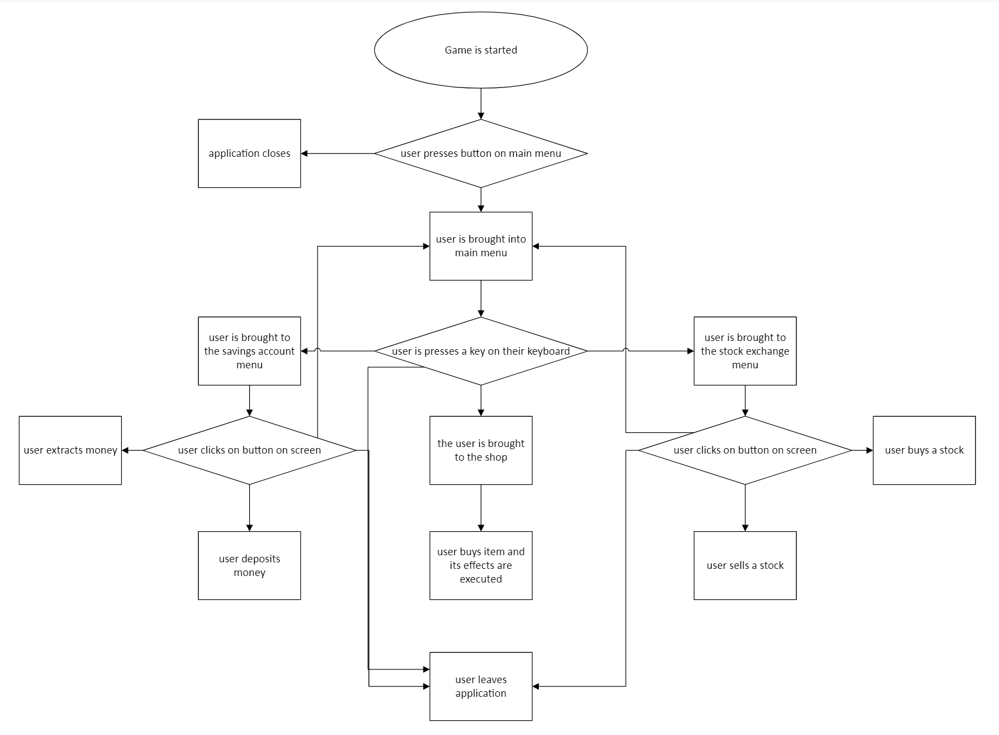

Hackathon <WHACK> README 

Project name:Pet Payday  

Description of the project: 
Our mission: educating young chidlren on the importance of saving money by gamifying their learning experience.  
The project intends to gamify saving money while also managing your expenses, which will make saving money seem like a positive and enjoyable experience. The main aim of the game is to take care of your pet dog, Chip. There are 3 factors which can affect the dogs health: hunger, thirst and happiness. Both hunger and thirst slowly go down every hour. The user must spend their money to buy food or water to maintain the dog healthy. If Chip's hunger and thrist are below a certain level, its happiness will decrease. Reaching zero in any of these factors will trigger a game over.   

The user recieves a predetermined salary every week and can choose to spend it on a number of things. The player can invest in different stocks which can increase or decrease in value. There are both safe and unsafe stocks: safe stocks are more likely to increase in value but they do not increase/ decrease by a lot. Unsafe stocks are far more volatile and are far more likely to go down in value but when they do increase in value it will be by a larger percentage.  
The player can also put money into a savings account which locks the money away for a month but after the timer has finished the user will gain the money back plus 2.5% interest on that amount. On top of this, the user does also have a standard interest of 1.5% per month. However items in the shop are affected by inflation so will increase every month making the game harder. In addition, the user also has to pay rent every month, teaching children about the idea of taxes and rent through a simple task. The player can also save up their money to buy decorations for the room as well as clothes for their pet.  
On the shop menu the users are told many tips about saving and increasing their financial literacy.
  

Use-case example 
An example use case is a couple who have a 8-12 year old child. They would like to teach their son the importance of saving money before setting up thier child with a bank account and or debit card. To do this they decide to install our app on their childs tablet or phone. Once their son gets home from school every day, he spends 5-10 minutes checking up on his pet. During this 10 minute period the child has many things he can do with his money. He is tasked with buying the dogs's outfit and every decorative item for the dogs room without letting the dog fall ill. This task is designed to take time and patience, if the child decides to buy some of the necessary decorations straight away, they will not have enough money for food later on. The child must wait till they have enough money to mantain the dog's health as well as have enough to save at the end of every week for spending on decorations.   

Instructions to run the project 
Special considerations, if any -- if any API keys are required (provide judges with link to generate key)
we used  
panda,pygame,matplotlib python libraries were used and need to be installed before running the application 
 
Could also include architecture diagrams in the file

